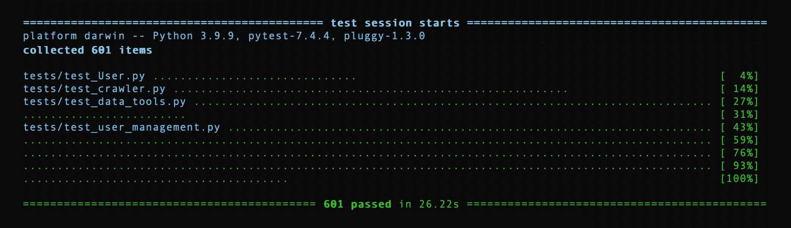

<div align="center" style="height:120px; margin: 40px"></div>

# Overview
This library helps automate many account management and posting activities for Twitter/X. Its primary functionality is to automate –

* Scraping to find relevant users to follow
* Account following
* Account unfollowing


<br/>
<br/>


# Installation
The library can be installed by downloading and pip installing the latest wheel file in <a href="https://github.com/khbateman/TwitterTools/releases">**Releases**</a>.
```
pip install TwitterTools-1.3.14-py3-none-any.whl
```

<br/>
<br/>

# Basic Structure
The library source code is located in the `TwitterTools` directory, and the tests files / resources are located in the `tests` directory. Jupyter notebooks that serve as a makeshift UI for primary actions are located in `notebooks`.

```
|-── Root
      |-── TwitterTools
      │       |── User.py
      │       |── crawler.py
      │       |── data_tools.py
      │       |── data_tools.py
      │       |── driver_tools.py
      │       |── flows.py
      │       └–– user_management.py
      |-── notebooks
      └-── tests
              |── tests files
              └–– Testing_Resources
                      └–– Files used within tests
```

### Source Code
* `User.py` - class representing a Twitter user (account details and whether or not I follow them and they follow me)
* `crawler.py` - functions for the Selenium driver that manages browser crawling / scraping activity
* `data_tools.py` - functions that manipulate Pandas dataframes, change data structures into different forms, and properly save / read data for a given project
* `driver_tools.py` - properly sets up Selenium driver and logs into Twitter
* `flows.py` - primary functions for an end user. These represent the main activities for the library.
* `user_management.py` - various analysis functions for Users

### Notebooks / GUI
Since no formal GUI exists for this library, Jupyter notebooks are provided as a makeshift user interface. Detailed instructions are in the notebooks for completing various Twitter activities with the library. Additionally, an intentional design choice was made to use Excel to save data rather than a database. A database would be a preferable choice in the future if an additional GUI is created. However, some of the data must be manipulated manually by the user (ex - adding some accounts to skip while manually reviewing). This would be extremely tedious to manually run database commands for each addition. So, Excel provides a nice makeshift UI in the absence of a formal interface. With a formal UI in the future, each Excel file could be easily migrated to database tables.

### Tests
This library is thoroughly tested with `Pytest` for each release. Before making any change within the library, it's recommended to run the full testing suite to ensure nothing breaks. To run the suite, run the following command after navigating to the root directory of the project. You should get a result like the image that follows.

```
python3 -m pytest tests/
```

<div align="center" style="max-height: 200px; margin: 20px 0px"></div>

<br/>
<br/>

# Suggested follower scraping
`flows.update_excel_file_with_accounts_to_follow()` uses various auto-scrolling techniques to scrape Twitter to find useful accounts to follow. This includes - 

* Scraping the followers of related accounts
* Scraping users from specified search queries
* Scraping interactions (retweets, quotes, likes) from specified posts

This method additionally skips any user that has been previously followed by the account to avoid spamming the same accounts repeatedly. Also, the library can further screen scraped users using `flows.validate_accounts_to_follow()` by systematically navigating to their profiles and checking if each user has recent activity, has a certain threshold of followers, and has at least a certain number of total posts / likes.

<div align="center" style="margin: 20px 0px"></div>

<br/>
<br/>

# Account following
Using the data scraped from the techniques described above to scrape relevant accounts, the library can open tabs automatically for following users using `crawler.open_tabs_for_unfollowing()`. This method opens tabs with random pauses in between to avoid Twitter's rate limits.


<br/>
<br/>

# Account unfollowing

`flows.update_my_following_data()` scrapes the logged-in user's current following and updates saved data.

`crawler.open_tabs_for_unfollowing()` analyzes the saved following data and opens tabs to unfollow those that haven't followed back after a specified number of days. It randomly pauses between tabs to avoid Twitter rate limits.